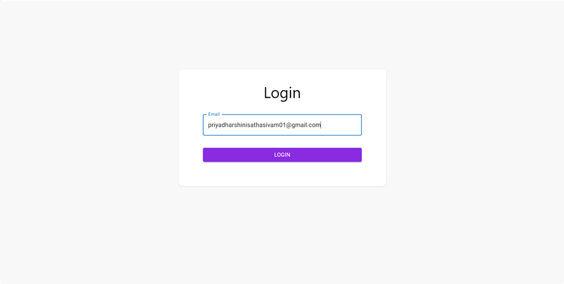
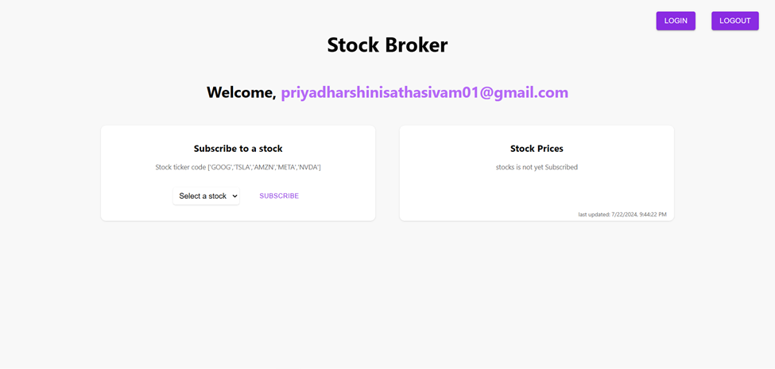
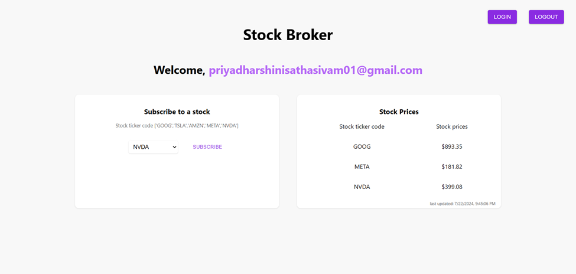
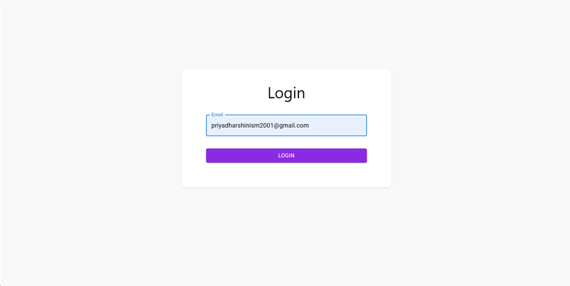
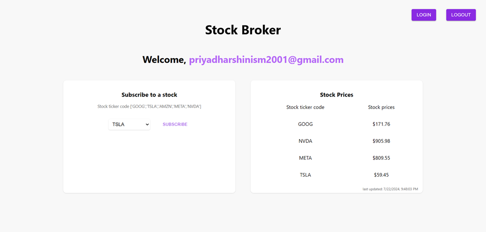

# Escrow_Stack Assignments
## Assignment 2
### Stock Broker Client Web Dashbaord

This project is a stock broker client web dashboard built with React. It includes user authentication, real-time stock price updates, and stock subscription management, using local storage for data persistence and Material-UI (MUI) for styling.

Features
- Login Component: User authentication with email.
- Dashboard Component: Displays user info and subscribed stocks.
- StockPrice Component: Real-time stock price updates.
- StockSubscribe Component: Manage stock subscriptions.
- MUI Styling: Consistent and responsive design.

### Get started with application

Clone the repository:

```
git clone https://github.com/priyadharshini149/Escrow.git
cd stockapp
```

Install dependencies:

```
npm install
```

### Running the Application

Start the development server:

```
npm start
```

### Screenshots





