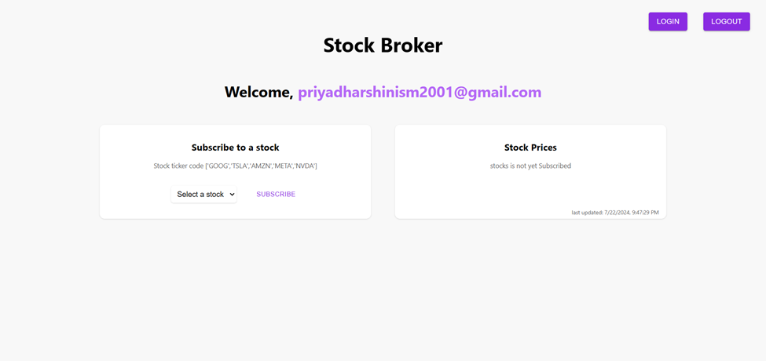

# Escrow_Stack Assignments
## Assignment 1
### Mockup

This assignment involves replicating a [figma design](https://www.figma.com/design/KG0oTPovCJG73nGdtTP9yZ/load?t=TQTVgxAIuI0rhlS8-0) using React (or another framework). The main objectives are:

- Display Account Details: Show account information on a dashboard based on the selected company and account from dropdown menus.
- API Integration: Use an API to dynamically display the company and account details.


## Assignment 2
### Stock Broker Client Web Dashbaord

This project is a stock broker client web dashboard built with React. It includes user authentication, real-time stock price updates, and stock subscription management, using local storage for data persistence and Material-UI (MUI) for styling.

Features
- Login Component: User authentication with email.
- Dashboard Component: Displays user info and subscribed stocks.
- StockPrice Component: Real-time stock price updates.
- StockSubscribe Component: Manage stock subscriptions.
- MUI Styling: Consistent and responsive design.

### Get started with application

Clone the repository:

```
git clone https://github.com/priyadharshini149/Escrow.git

//assignment 1
cd mockup

//assignment 2
cd stockapp
```

Install dependencies:

```
npm install
```

### Running the Application

Start the development server:

```
npm start
```

### Assignment 1
### Application is deployed in Netlify

Application: [escrowassign1.netlify.app](https://escrowassign1.netlify.app/)

### Screenshots


### Assignment 2
### Application is deployed in Netlify

Application: [escrowassign2.netlify.app](https://escrowassign2.netlify.app/)

### Screenshots




